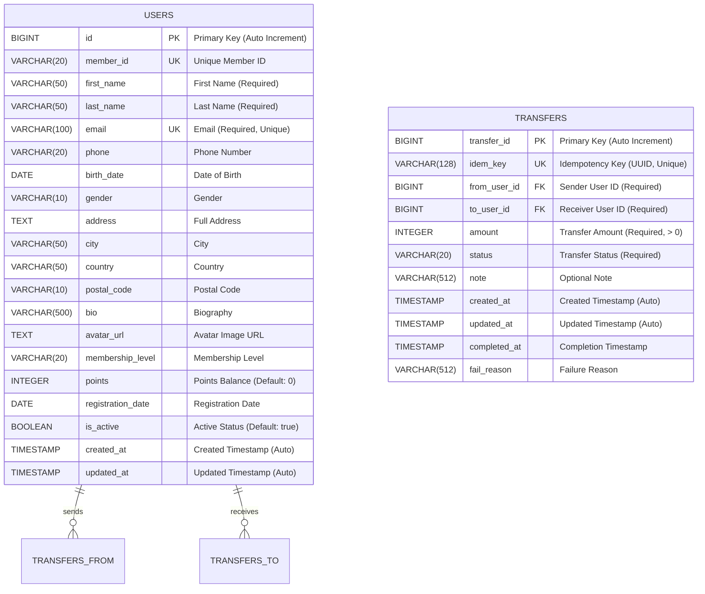

# Database Documentation

## Overview

This document describes the database schema for the **LBK Points Management System** (Hello World Backend). The system uses **SQLite** as the database engine and implements a Clean Architecture pattern with JPA/Hibernate for ORM.

## Database Technologies

- **Database**: SQLite
- **ORM**: Hibernate/JPA
- **Connection Pool**: HikariCP (default with Spring Boot)
- **Migration**: Automatic via `spring.jpa.hibernate.ddl-auto=update`

---

## Entity Relationship Diagram



---

## Table Specifications

### 1. USERS Table

Stores user information including personal details, membership data, and points balance.

| Column Name | Data Type | Constraints | Description |
|------------|-----------|-------------|-------------|
| `id` | BIGINT | PRIMARY KEY, AUTO_INCREMENT | Unique user identifier |
| `member_id` | VARCHAR(20) | UNIQUE | Unique member ID for external reference |
| `first_name` | VARCHAR(50) | NOT NULL | User's first name |
| `last_name` | VARCHAR(50) | NOT NULL | User's last name |
| `email` | VARCHAR(100) | NOT NULL, UNIQUE | User's email address (unique) |
| `phone` | VARCHAR(20) | | User's phone number |
| `birth_date` | DATE | | User's date of birth |
| `gender` | VARCHAR(10) | | User's gender |
| `address` | TEXT | | Full address |
| `city` | VARCHAR(50) | | City |
| `country` | VARCHAR(50) | | Country |
| `postal_code` | VARCHAR(10) | | Postal/ZIP code |
| `bio` | VARCHAR(500) | | User biography |
| `avatar_url` | TEXT | | URL to user's avatar image |
| `membership_level` | VARCHAR(20) | | Membership tier (e.g., Bronze, Silver, Gold) |
| `points` | INTEGER | DEFAULT 0 | Current points balance |
| `registration_date` | DATE | | Date when user registered |
| `is_active` | BOOLEAN | NOT NULL, DEFAULT TRUE | Whether user account is active |
| `created_at` | TIMESTAMP | NOT NULL, AUTO | Record creation timestamp |
| `updated_at` | TIMESTAMP | AUTO | Record last update timestamp |

**Indexes:**
- Primary Key: `id`
- Unique Index: `member_id`
- Unique Index: `email`

**Business Rules:**
- Email must be unique across all users
- Points cannot be negative (enforced by domain logic)
- Inactive users cannot send or receive transfers
- Full name = `first_name + last_name`

---

### 2. TRANSFERS Table

Stores all points transfer transactions between users with full audit trail.

| Column Name | Data Type | Constraints | Description |
|------------|-----------|-------------|-------------|
| `transfer_id` | BIGINT | PRIMARY KEY, AUTO_INCREMENT | Unique transfer identifier |
| `idem_key` | VARCHAR(128) | NOT NULL, UNIQUE | Idempotency key (UUID) for API safety |
| `from_user_id` | BIGINT | NOT NULL | Sender's user ID |
| `to_user_id` | BIGINT | NOT NULL | Receiver's user ID |
| `amount` | INTEGER | NOT NULL | Transfer amount (must be > 0) |
| `status` | VARCHAR(20) | NOT NULL | Transfer status (see enum below) |
| `note` | VARCHAR(512) | | Optional transfer note/memo |
| `created_at` | TIMESTAMP | NOT NULL, AUTO | Transfer creation timestamp |
| `updated_at` | TIMESTAMP | NOT NULL, AUTO | Last update timestamp |
| `completed_at` | TIMESTAMP | | Timestamp when transfer completed |
| `fail_reason` | VARCHAR(512) | | Reason for failure (if status = FAILED) |

**Indexes:**
- Primary Key: `transfer_id`
- Unique Index: `idem_key`
- Index: `from_user_id` (for querying sender's transfers)
- Index: `to_user_id` (for querying receiver's transfers)

**Transfer Status Enum:**
- `PENDING` - Transfer created but not yet processed
- `PROCESSING` - Transfer is being processed
- `COMPLETED` - Transfer successfully completed
- `FAILED` - Transfer failed (e.g., insufficient points)
- `CANCELLED` - Transfer cancelled before completion
- `REVERSED` - Transfer reversed after completion

**Business Rules:**
- `from_user_id` must exist in USERS table
- `to_user_id` must exist in USERS table
- `from_user_id` cannot equal `to_user_id` (cannot transfer to self)
- Amount must be positive (> 0)
- Sender must have sufficient points (points >= amount)
- Both sender and receiver must be active users
- `idem_key` ensures idempotency for API calls

---

## Relationships

### USERS to TRANSFERS (One-to-Many)

1. **As Sender (from_user_id)**
   - One user can send multiple transfers
   - Foreign key: `TRANSFERS.from_user_id` → `USERS.id`
   - Navigation: `User` → `List<Transfer>` (sent transfers)

2. **As Receiver (to_user_id)**
   - One user can receive multiple transfers
   - Foreign key: `TRANSFERS.to_user_id` → `USERS.id`
   - Navigation: `User` → `List<Transfer>` (received transfers)

**Note:** The relationship is not enforced at database level (no FK constraints) to maintain loose coupling in Clean Architecture, but is validated at application level.

---

## Database Configuration

### Connection Properties (application.properties)

```properties
# Database Connection
spring.datasource.url=jdbc:sqlite:database.db
spring.datasource.driver-class-name=org.sqlite.JDBC

# Hibernate Configuration
spring.jpa.database-platform=org.hibernate.community.dialect.SQLiteDialect
spring.jpa.hibernate.ddl-auto=update
spring.jpa.show-sql=false

# Connection Pool (HikariCP)
spring.datasource.hikari.maximum-pool-size=10
spring.datasource.hikari.minimum-idle=5
spring.datasource.hikari.connection-timeout=20000
```

---

## Sample Data

### Users Table Sample

| id | first_name | last_name | email | points | is_active |
|----|-----------|-----------|-------|--------|-----------|
| 1 | สมชาย | ใจดี | somchai@example.com | 1000 | true |
| 2 | สมหญิง | รักดี | somying@example.com | 500 | true |
| 3 | สมศักดิ์ | สุขใจ | somsak@example.com | 750 | true |

### Transfers Table Sample

| transfer_id | idem_key | from_user_id | to_user_id | amount | status | created_at |
|------------|----------|--------------|------------|--------|--------|------------|
| 1 | 5d1f8c7a-2b5b... | 1 | 2 | 100 | COMPLETED | 2025-11-10 14:00:00 |
| 2 | a8b4f2e0-5562... | 2 | 3 | 50 | COMPLETED | 2025-11-10 14:05:00 |

---

## Query Examples

### 1. Get User with Points Balance
```sql
SELECT id, first_name, last_name, email, points, is_active
FROM users
WHERE email = 'somchai@example.com';
```

### 2. Get All Transfers for a User (Sent or Received)
```sql
SELECT t.transfer_id, t.idem_key, t.from_user_id, t.to_user_id, 
       t.amount, t.status, t.created_at
FROM transfers t
WHERE t.from_user_id = 1 OR t.to_user_id = 1
ORDER BY t.created_at DESC;
```

### 3. Get User's Total Sent Points
```sql
SELECT SUM(amount) as total_sent
FROM transfers
WHERE from_user_id = 1 AND status = 'COMPLETED';
```

### 4. Get User's Total Received Points
```sql
SELECT SUM(amount) as total_received
FROM transfers
WHERE to_user_id = 1 AND status = 'COMPLETED';
```

### 5. Get Transfer History with User Details
```sql
SELECT 
    t.transfer_id,
    t.idem_key,
    u1.first_name || ' ' || u1.last_name as sender_name,
    u2.first_name || ' ' || u2.last_name as receiver_name,
    t.amount,
    t.status,
    t.note,
    t.created_at
FROM transfers t
JOIN users u1 ON t.from_user_id = u1.id
JOIN users u2 ON t.to_user_id = u2.id
WHERE t.status = 'COMPLETED'
ORDER BY t.created_at DESC;
```

### 6. Get Active Users with Points > 500
```sql
SELECT id, first_name, last_name, email, points
FROM users
WHERE is_active = true AND points > 500
ORDER BY points DESC;
```

---

## Data Integrity Rules

### Application-Level Validation

1. **User Validation**
   - Email must be valid format and unique
   - First name and last name are required
   - Points cannot be negative
   - Phone must match valid format (if provided)

2. **Transfer Validation**
   - Amount must be positive (> 0)
   - Sender must have sufficient points
   - Cannot transfer to self
   - Both users must exist and be active
   - Note cannot exceed 512 characters

3. **Transaction Safety**
   - All transfers are atomic (all-or-nothing)
   - Points deduction and addition happen in same transaction
   - Failed transfers are recorded with reason
   - Idempotency key prevents duplicate transfers

---

## Backup and Maintenance

### Database Backup
```bash
# Backup SQLite database
cp database.db database_backup_$(date +%Y%m%d_%H%M%S).db

# Restore from backup
cp database_backup_20251110_140000.db database.db
```

### Database Reset (Development)
```bash
# Delete database to start fresh
rm -f database.db

# Restart application - tables will be recreated
./mvnw spring-boot:run
```

---

## Performance Considerations

1. **Indexes**: Primary keys and unique constraints automatically create indexes
2. **Query Optimization**: Use JPA query methods with proper naming conventions
3. **Connection Pooling**: HikariCP provides efficient connection management
4. **Pagination**: Always use pagination for list queries (default pageSize: 20, max: 200)
5. **Lazy Loading**: Entity relationships use lazy loading to avoid N+1 queries

---

## Future Enhancements

1. **Add Foreign Key Constraints**: Consider adding FK constraints for referential integrity
2. **Audit Log Table**: Track all changes to users and transfers
3. **Transaction History**: Separate table for detailed transaction logs
4. **User Preferences**: Additional table for user settings and preferences
5. **Notification Queue**: Table for pending notifications about transfers
6. **Points Expiration**: Add expiry date tracking for points

---

## Migration History

| Version | Date | Description |
|---------|------|-------------|
| 1.0.0 | 2025-11-10 | Initial schema with USERS table |
| 1.1.0 | 2025-11-10 | Added TRANSFERS table for points transfer feature |

---

## Related Documentation

- [Clean Architecture Guide](CLEAN_ARCHITECTURE.md)
- [API Documentation](USER_API_DOCUMENTATION.md)
- [Quick Start Guide](QUICK_START.md)
- [Project Summary](PROJECT_SUMMARY.md)

---

**Last Updated**: November 10, 2025  
**Database Version**: 1.1.0  
**Schema**: SQLite with JPA/Hibernate
